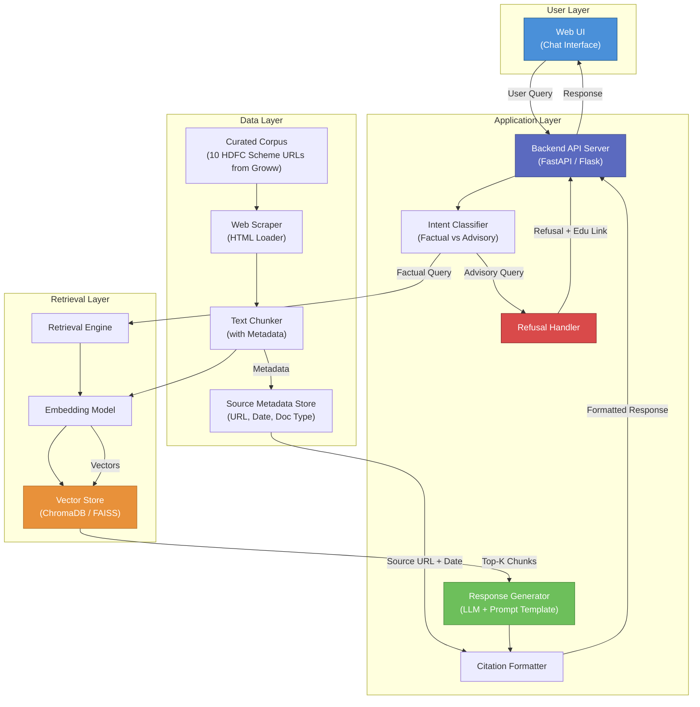
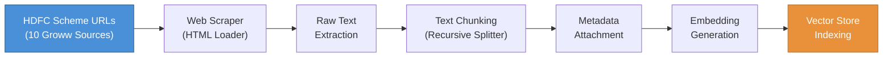
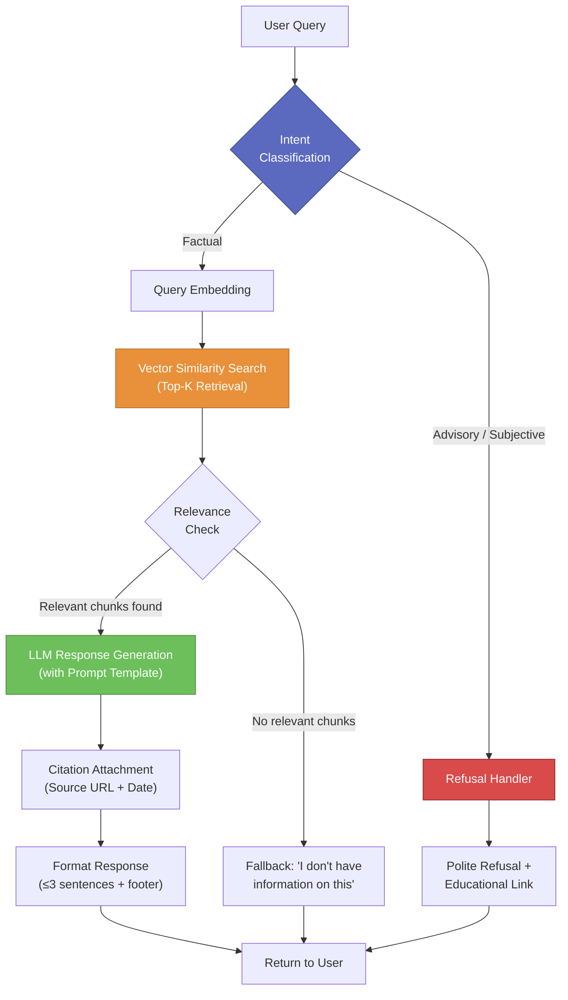
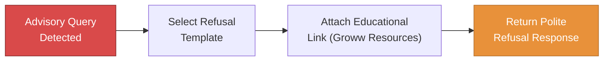
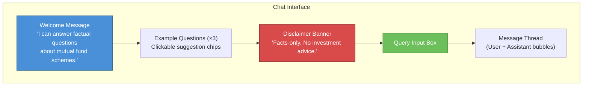
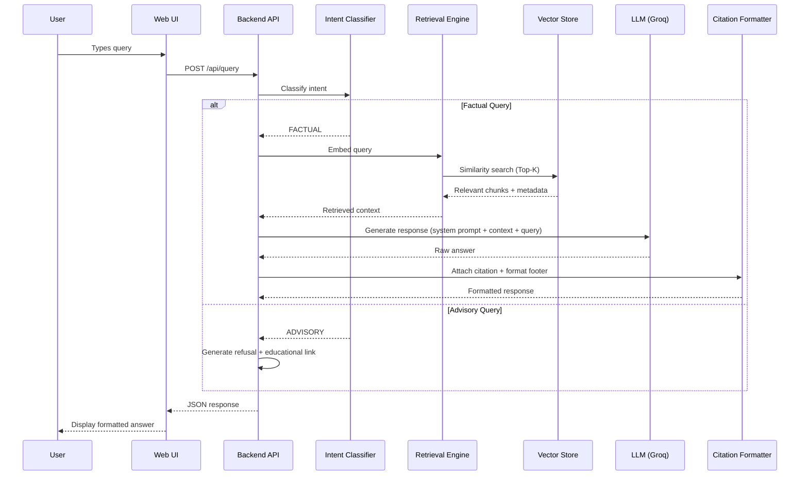
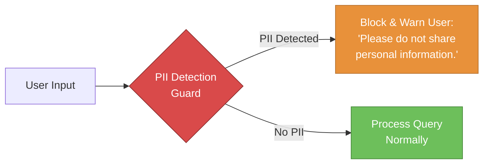

# Architecture Document: Mutual Fund FAQ Assistant

> A detailed technical architecture for the RAG-based Mutual Fund FAQ Assistant. Derived from the [Project Context](file:///c:/Users/DELL/Pictures/Milestone%201/RAG%20Chatbot/docs/context.md) and [Problem Statement](file:///c:/Users/DELL/Pictures/Milestone%201/RAG%20Chatbot/docs/problemstatement.md).

---

## 1. Architecture Overview

The Mutual Fund FAQ Assistant is a **Retrieval-Augmented Generation (RAG)** system that answers factual queries about **HDFC Mutual Fund** schemes. It retrieves information from a curated corpus of web pages sourced exclusively from Groww (covering 10 HDFC scheme URLs) and generates concise, source-backed responses while strictly refusing advisory or subjective queries.

### 1.1. Design Principles

| Principle | Description |
| :--- | :--- |
| **Accuracy over Intelligence** | Prefer exact retrieval from official sources over creative generation |
| **Zero Advisory Tolerance** | The system must never produce investment advice, opinions, or recommendations |
| **Source Transparency** | Every answer must be traceable to a Groww source web page via citation |
| **Privacy by Design** | No PII collection, storage, or processing at any layer |
| **Minimal Footprint** | Lightweight, single-AMC-focused implementation — not an enterprise search engine |

---

## 2. High-Level System Architecture



---

## 3. Component Architecture

### 3.1. Data Ingestion Pipeline & Automated Scheduler (GitHub Actions)

The ingestion pipeline transforms raw Groww HTML web pages into a searchable vector store. To ensure the chatbot always fetches real-time or latest mutual fund scheme data (NAV, expense ratio, AUM, etc.) without server-side memory overhead, an **Automated Ingestion Scheduler** powered by **GitHub Actions** (`.github/workflows/scheduled_ingestion.yml`) periodically triggers on a cron schedule (`0 5 * * *` for 10:30 AM IST / 05:00 UTC), sending an authenticated webhook to the live server (`POST /api/ingest` with `INGEST_ADMIN_TOKEN`) or executing standalone offline builds. Thread-safe mutex locking (`vector_store_lock`) ensures zero index corruption during live queries.



#### 3.1.1. Source Collection

| Component | Details |
| :--- | :--- |
| **Source URLs** | 10 curated HDFC Mutual Fund scheme URLs sourced exclusively from Groww |
| **Document Types** | Scheme Overview Web Pages from Groww |
| **Loader Strategy** | Use HTML scrapers/loaders for Groww web pages (no PDFs or external sources) |

#### Selected HDFC Scheme URLs (Corpus Sources)

| # | Scheme Name | Category | Groww URL |
| :--- | :--- | :--- | :--- |
| 1 | HDFC Nifty 50 Index Fund | Equity Index | https://groww.in/mutual-funds/hdfc-nifty-50-index-fund-direct-growth |
| 2 | HDFC BSE Sensex Index Fund | Equity Index | https://groww.in/mutual-funds/hdfc-bse-sensex-index-fund-direct-growth |
| 3 | HDFC Children's Fund | Goal-Based | https://groww.in/mutual-funds/hdfc-children's-fund-direct-plan |
| 4 | HDFC Banking & Financial Services Fund | Sectoral | https://groww.in/mutual-funds/hdfc-banking-financial-services-fund-direct-growth |
| 5 | HDFC Corporate Debt Opportunities Fund | Debt | https://groww.in/mutual-funds/hdfc-corporate-debt-opportunities-fund-direct-growth |
| 6 | HDFC Gold ETF Fund of Fund | Commodity | https://groww.in/mutual-funds/hdfc-gold-etf-fund-of-fund-direct-plan-growth |
| 7 | HDFC Nifty Next 50 Index Fund | Equity Index | https://groww.in/mutual-funds/hdfc-nifty-next-50-index-fund-direct-growth |
| 8 | HDFC Nifty500 Multicap 50:25:25 Index Fund | Multicap Index | https://groww.in/mutual-funds/hdfc-nifty500-multicap-50:25:25-index-fund-direct-growth |
| 9 | HDFC Diversified Equity All Cap Active FoF | Fund of Funds | https://groww.in/mutual-funds/hdfc-diversified-equity-all-cap-active-fof-direct-growth |
| 10 | HDFC Nifty India Digital Index Fund | Thematic Index | https://groww.in/mutual-funds/hdfc-nifty-india-digital-index-fund-direct-growth |

#### 3.1.2. Document Processing

| Step | Implementation | Details |
| :--- | :--- | :--- |
| **Text Extraction** | `BeautifulSoup` / `LangChain WebBaseLoader` | Extract clean text from Groww HTML pages |
| **Text Chunking** | `RecursiveCharacterTextSplitter` | Split documents into semantically meaningful chunks (recommended: 500–1000 tokens per chunk with 100–200 token overlap) |
| **Metadata Tagging** | Custom metadata attachment | Each chunk gets tagged with: `source_url`, `document_type`, `scheme_name`, `last_scraped_date`, `amc_name` |

#### 3.1.3. Chunk Metadata Schema

```json
{
  "chunk_id": "string (UUID)",
  "text": "string (chunk content)",
  "source_url": "string (official URL)",
  "document_type": "enum [groww_scheme_page]",
  "scheme_name": "string | null",
  "amc_name": "HDFC Mutual Fund",
  "last_scraped_date": "ISO 8601 date",
  "chunk_index": "integer"
}
```

---

### 3.2. Embedding & Vector Storage

| Component | Selected Option | Rationale |
| :--- | :--- | :--- |
| **Embedding Model** | `BAAI/bge-small-en-v1.5` (384-dim BGE Model) | Optimized for short, enriched factual financial chunks; delivers high semantic precision with minimal RAM/CPU footprint |
| **Vector Store** | ChromaDB (local) or FAISS | ChromaDB for ease of metadata filtering; FAISS for raw speed on smaller corpora |
| **Embedding Dimensions** | 384 (`bge-small`) | Fixed 384-dimensional dense vectors normalized for cosine similarity |
| **Distance Metric** | Cosine Similarity (`normalize_embeddings=True`) | Standard for semantic search with L2 normalized BGE embeddings |

#### 3.2.1. Embedding Strategy & Model Selection (BGE Small vs. Large)

Based on empirical analysis of our data ingestion chunks (`~1200 chars / ~300 tokens` per chunk across 10 Groww scheme pages), we standardize on **`BAAI/bge-small-en-v1.5`** rather than larger models (`bge-large-en-v1.5` or `bge-base-en-v1.5`).

| Selection Criteria | `BAAI/bge-small-en-v1.5` (Selected) | Large Models (`bge-large-en-v1.5`) | Analysis & Rationale |
| :--- | :--- | :--- | :--- |
| **Synergy with Enriched Chunks** | **Optimal**: Chunks already contain prepended Contextual Headers (`[Scheme: ... \| Category: ...]`). | **Overkill**: High parameter capacity (1024 dims) is redundant when entity names are explicitly prepended. | The 384-dim vector space effortlessly separates scheme-specific metrics (NAV, exit loads, expense ratio) without needing deep attention layers for entity disambiguation. |
| **RAM & Footprint** | **~130 MB** RAM footprint | **~1.5 GB+** RAM footprint | Aligns with our **Minimal Footprint** design principle (§1.1); runs locally without GPU or heavy hardware requirements. |
| **Inference Speed** | **<15 ms** per batch on CPU | **~80–100 ms** per batch on CPU | Ensures ultra-fast retrieval latency for interactive chat responses. |

**BGE Asymmetric Search Encoding Rules:**
- **Document Ingestion (Chunks)**: Encode chunk text directly (with prepended headers) with unit L2 normalization (`normalize_embeddings=True`). Do NOT attach query instruction prefixes to document chunks.
- **Query Retrieval (User Queries)**: At search time, all user queries **MUST** be prefixed with BGE's asymmetric query instruction: `"Represent this sentence for searching relevant passages: "`. This maps short user queries to the document embedding distribution in vector space.

#### 3.2.2. Vector Store Schema

```
Collection: mutual_fund_chunks
├── id: chunk_id (UUID)
├── embedding: float[] (384 dims for bge-small)
├── document: chunk text
└── metadata:
    ├── source_url
    ├── document_type
    ├── scheme_name
    ├── amc_name
    └── last_scraped_date
```

---

### 3.3. Query Processing Pipeline

When a user submits a query, it flows through the following stages:



#### 3.3.1. Intent Classification

The first gate determines whether a query is factual (processable) or advisory (refusable).

| Approach | Description |
| :--- | :--- |
| **Primary: LLM-based Classification** | Use a lightweight prompt to the LLM asking it to classify the query as `FACTUAL` or `ADVISORY` before retrieval |
| **Fallback: Keyword Heuristics** | Pattern-match against advisory keywords/phrases — *"should I"*, *"which is better"*, *"recommend"*, *"good time to"*, *"safe for"* |
| **Output** | `{ "intent": "FACTUAL" | "ADVISORY", "confidence": float }` |

#### 3.3.2. Retrieval Strategy

To maximize precision across our 10-scheme corpus (115 chunks) and prevent cross-scheme contamination (e.g., mixing Nifty 50 and Sensex metrics), the retrieval engine executes a multi-stage **Metadata-Aware Cosine Retrieval Strategy**:

1. **Asymmetric Query Prefixing**: Every natural language query is prepended with the mandatory BGE instruction prefix: `"Represent this sentence for searching relevant passages: "` before L2 normalization and encoding (`normalize_embeddings=True`).
2. **Smart Scheme & Category Detection**: The retriever scans the query for scheme aliases and keywords (e.g., `"nifty 50"`, `"children"`, `"gold etf"`, `"banking"`, `"multicap"`). If a specific scheme is identified, a ChromaDB `where` metadata filter (`{"scheme_name": {"$eq": matched_scheme}}`) is constructed to scope the search exclusively to that fund.
3. **Cosine Distance to Similarity Conversion**: ChromaDB returns Cosine Distance ($d \in [0, 2]$). The retriever converts distance to exact Cosine Similarity ($S = 1.0 - d$).
4. **Similarity Threshold & Fallback**: Chunks are filtered against a configurable threshold (default `0.70`, tunable via `SIMILARITY_THRESHOLD` in `settings.py`). If a metadata-filtered search returns 0 chunks above threshold (e.g., due to an ambiguous scheme name or broad cross-fund query), the retriever automatically falls back to an unfiltered search across the entire corpus to guarantee robust recall.

| Parameter | Value | Rationale |
| :--- | :--- | :--- |
| **Top-K** | `5` (configurable via `RETRIEVAL_TOP_K`) | Captures primary scheme stats, tax rules, and holdings without overwhelming LLM context window |
| **Distance Metric** | Cosine Distance converted to Similarity ($1.0 - d$) | Aligns directly with unit L2-normalized BGE vectors |
| **Similarity Threshold** | `0.70` (configurable via `SIMILARITY_THRESHOLD`) | Filters out low-relevance paragraphs while preserving valid answers |
| **Metadata Scoping** | Dynamic `scheme_name` matching with automatic fallback | Eliminates cross-scheme hallucinations (e.g., wrong NAV or exit load) |

#### 3.3.3. Response Generation

| Component | Details |
| :--- | :--- |
| **LLM** | Groq (`llama-3.3-70b-versatile`) | Ultra-fast inference with Llama 3.3 70B; protected by token budget control and exponential backoff to adhere to free tier limits (30 RPM, 1K RPD, 12K TPM, 100K TPD) |
| **Prompt Strategy** | System prompt enforcing facts-only, 3-sentence max, single citation, mandatory footer |
| **Context Window** | Cap retrieved chunks to `top_k=3–4` (~800–1,000 tokens max) to stay below 12K TPM limit |
| **Temperature** | `0.0` — deterministic, factual output with no creative variation |

#### System Prompt Template

```text
You are a facts-only mutual fund FAQ assistant. You answer questions using ONLY 
the provided context from official Groww source pages. You MUST follow these rules strictly:

1. Answer in a maximum of 3 sentences.
2. Include exactly ONE source citation link from the provided context.
3. End every response with: "Last updated from sources: <date>"
4. NEVER provide investment advice, opinions, or recommendations.
5. NEVER compare funds or predict future returns.
6. If the context does not contain the answer, say "I don't have verified 
   information on this. Please check the Groww scheme page or official AMC website."

Context:
{retrieved_chunks}

User Question: {user_query}
```

---

### 3.4. Refusal Handling Module

When the Intent Classifier flags a query as advisory or subjective:



#### Refusal Template
```text
I'm a facts-only assistant and cannot provide investment advice, fund comparisons, 
or future return predictions. For personalized guidance, please consult a 
SEBI-registered financial advisor.

You may find helpful resources here: {educational_link}

Last updated from sources: {date}
```

#### Educational Link Pool
| Source | URL |
| :--- | :--- |
| Groww Mutual Funds Help | `https://groww.in/help/mutual-funds` |
| Groww Mutual Funds Blog | `https://groww.in/blog/category/mutual-funds` |
| Groww Mutual Fund Screener | `https://groww.in/mutual-funds/filter` |

---

### 3.5. Citation & Formatting Module

Responsible for enforcing the strict output format on every response.

| Rule | Enforcement Mechanism |
| :--- | :--- |
| **≤ 3 Sentences** | Post-processing validator counts sentence boundaries; truncates if exceeded |
| **Exactly 1 Citation** | Extract `source_url` from top-ranked retrieved chunk metadata |
| **Mandatory Footer** | Append `"Last updated from sources: <date>"` using `last_scraped_date` from chunk metadata |

---

## 4. User Interface Architecture

### 4.1. Frontend Stack

| Component | Technology | Rationale |
| :--- | :--- | :--- |
| **Framework** | HTML + Vanilla CSS + JavaScript (or Streamlit for MVP) | Lightweight, no heavy framework overhead |
| **Chat Interface** | Custom chat widget or Streamlit `st.chat_message` | Clean, conversational UX |
| **Styling** | Minimal, Groww-inspired color palette | Aligns with reference product context |

### 4.2. UI Component Map



### 4.3. Mandatory UI Elements

| Element | Specification |
| :--- | :--- |
| **Welcome Message** | Displayed on first load; explains capabilities and limitations |
| **Example Questions** | 3 clickable chips: e.g., *"What is the expense ratio of [Scheme]?"*, *"What is the exit load for [Scheme]?"*, *"What is the NAV of [Scheme]?"* |
| **Disclaimer** | Persistent banner or footer: **"Facts-only. No investment advice."** |
| **Source Citation** | Rendered as a clickable hyperlink in each assistant response |
| **Last Updated Footer** | Rendered in muted text below each response |

---

## 5. Backend API Architecture

### 5.1. Technology Stack

| Layer | Technology | Rationale |
| :--- | :--- | :--- |
| **API Framework** | FastAPI (Python) | Async support, auto-generated docs, type safety |
| **LLM Integration** | LangChain (`langchain-groq`) or direct Groq SDK | Simplifies prompt chaining, retrieval, and response generation via Groq API |
| **Vector Store** | ChromaDB or FAISS | Local, lightweight, no external DB dependency |
| **Embedding** | BGE Small (`BAAI/bge-small-en-v1.5` via `sentence-transformers` / `FastEmbed`, 384-dim) | High precision for enriched chunks with minimal CPU/memory footprint |
| **Document Loaders** | LangChain `WebBaseLoader` / `BeautifulSoup4` | Handles Groww HTML ingestion |
| **Environment** | Python 3.10+ | Compatibility with all ML/LLM libraries |

### 5.2. API Endpoints

| Method | Endpoint | Description |
| :--- | :--- | :--- |
| `POST` | `/api/query` | Accept a user query, return a formatted response |
| `GET` | `/api/health` | Health check endpoint |
| `GET` | `/api/schemes` | List available schemes in the corpus |
| `POST` | `/api/ingest` | Trigger corpus re-ingestion (admin only) |
| `GET` | `/api/ingest/status` | Check current scheduler status and last ingestion timestamp |

#### Request / Response Schema

**`POST /api/query`**

Request:
```json
{
  "query": "What is the expense ratio of HDFC Nifty 50 Index Fund?",
  "session_id": "optional-session-id"
}
```

Response (Factual):
```json
{
  "status": "success",
  "intent": "FACTUAL",
  "answer": "The expense ratio of HDFC Nifty 50 Index Fund Direct Growth is 0.20% per annum. This is the total annual charge deducted from the fund's NAV. Source: https://groww.in/mutual-funds/hdfc-nifty-50-index-fund-direct-growth",
  "source_url": "https://groww.in/mutual-funds/hdfc-nifty-50-index-fund-direct-growth",
  "last_updated": "2026-07-01",
  "disclaimer": "Facts-only. No investment advice."
}
```

Response (Refusal):
```json
{
  "status": "refused",
  "intent": "ADVISORY",
  "answer": "I'm a facts-only assistant and cannot provide investment advice or fund comparisons. For personalized guidance, please consult a SEBI-registered financial advisor.",
  "educational_link": "https://groww.in/help/mutual-funds",
  "last_updated": "2026-07-01",
  "disclaimer": "Facts-only. No investment advice."
}
```

---

## 6. Data Flow — End-to-End



---

## 7. Project Directory Structure

```
RAG Chatbot/
├── docs/
│   ├── problemstatementmf.txt        # Original problem statement (raw text)
│   ├── problemstatement.md           # Formatted problem statement
│   ├── context.md                    # Full project context
│   └── architecture.md               # This document
│
├── data/
│   ├── urls.json                     # Curated list of 10 HDFC scheme URLs from Groww
│   ├── raw/                          # Raw scraped HTML files
│   └── processed/                    # Cleaned text chunks with metadata
│
├── src/
│   ├── ingestion/
│   │   ├── scraper.py                # Web scraping of Groww HTML pages
│   │   ├── chunker.py                # Text chunking with metadata
│   │   ├── embedder.py               # Embedding generation & vector store indexing
│   │   └── scheduler.py              # Automated background cron scheduler for real-time data ingestion
│   │
│   ├── retrieval/
│   │   ├── retriever.py              # Vector similarity search logic
│   │   └── reranker.py               # Optional cross-encoder re-ranking
│   │
│   ├── generation/
│   │   ├── intent_classifier.py      # Factual vs Advisory classification
│   │   ├── response_generator.py     # LLM prompt construction & response generation
│   │   ├── refusal_handler.py        # Refusal template & educational link management
│   │   └── citation_formatter.py     # Citation attachment & output formatting
│   │
│   ├── api/
│   │   ├── main.py                   # FastAPI application entry point
│   │   ├── routes.py                 # API route definitions
│   │   └── schemas.py                # Pydantic request/response models
│   │
│   └── ui/
│       ├── index.html                # Chat interface (or Streamlit app.py)
│       ├── style.css                 # UI styling
│       └── script.js                 # Frontend logic
│
├── vectorstore/                      # Persisted vector store data (ChromaDB/FAISS)
│
├── config/
│   ├── settings.py                   # App configuration (API keys, model params, thresholds)
│   └── prompts.py                    # System prompts & refusal templates
│
├── tests/
│   ├── test_intent_classifier.py     # Unit tests for intent classification
│   ├── test_retriever.py             # Unit tests for retrieval accuracy
│   ├── test_response_format.py       # Unit tests for output format compliance
│   └── test_refusal.py              # Unit tests for refusal handling
│
├── requirements.txt                  # Python dependencies
├── .env.example                      # Environment variable template
└── README.md                         # Setup, architecture overview, known limitations
```

---

## 8. Technology Stack Summary

| Layer | Technology | Version |
| :--- | :--- | :--- |
| **Language** | Python | 3.10+ |
| **API Framework** | FastAPI | 0.100+ |
| **LLM Orchestration** | LangChain | 0.2+ |
| **LLM Provider** | Groq (e.g., Llama 3 / Mixtral models) | Latest |
| **Embeddings** | `BAAI/bge-small-en-v1.5` (384-dim BGE Model) | Latest |
| **Vector Store** | ChromaDB or FAISS | Latest |
| **Document Loaders** | `BeautifulSoup4`, LangChain `WebBaseLoader` | Latest |
| **Frontend** | HTML + CSS + JS (or Streamlit) | — |
| **Environment Management** | `python-dotenv` | Latest |
| **Testing** | `pytest` | Latest |

---

## 9. Configuration & Environment Variables

```env
# .env.example

# LLM Provider
GROQ_API_KEY=gsk_...

# Model Selection
LLM_MODEL=llama3-8b-8192
EMBEDDING_MODEL=BAAI/bge-small-en-v1.5

# Vector Store
VECTOR_STORE_TYPE=chromadb          # chromadb | faiss
VECTOR_STORE_PATH=./vectorstore

# Retrieval Parameters
RETRIEVAL_TOP_K=5
SIMILARITY_THRESHOLD=0.7

# Response Parameters
MAX_RESPONSE_SENTENCES=3
LLM_TEMPERATURE=0.0

# Scheduler & Ingestion
INGESTION_CRON=0 5 * * *            # 10:30 AM IST (05:00 UTC) daily cron trigger
INGESTION_INTERVAL_HOURS=24

# Server
API_HOST=0.0.0.0
API_PORT=8000
```

---

## 10. Security & Compliance Architecture

### 10.1. Privacy Controls



| Control | Implementation |
| :--- | :--- |
| **PII Detection** | Regex-based guard that scans input for PAN, Aadhaar, account numbers, OTPs, email, phone patterns |
| **No Data Persistence** | Queries and responses are not logged or stored beyond the active session |
| **No Authentication** | No user login or account system — fully anonymous access |
| **API Key Security** | LLM API keys stored in `.env`, never exposed to the frontend |

### 10.2. Content Safety Rails

| Rail | Mechanism |
| :--- | :--- |
| **Advisory Guard** | Intent Classifier blocks advisory queries before retrieval |
| **Source Lock** | Retrieval is limited to the pre-indexed vector store — no live web search |
| **Temperature Lock** | LLM temperature set to `0.0` to prevent creative/speculative output |
| **Output Validation** | Post-generation check ensures response contains ≤3 sentences, 1 citation, and the mandatory footer |

---

## 11. Scalability & Extension Points

While the current scope is a lightweight single-AMC implementation, the architecture supports future extension:

| Extension | How the Architecture Supports It |
| :--- | :--- |
| **Multi-AMC Support** | Add more URLs to `urls.json`; metadata filters on `amc_name` keep retrieval precise |
| **More Schemes** | Expand the corpus; vector store scales with additional chunks |
| **Scheduled Refresh** | Built-in background scheduler (`src/ingestion/scheduler.py`) triggers periodic ingestion to keep scheme data real-time |
| **Multi-language** | Add a translation layer before intent classification and after response generation |
| **Voice Interface** | Wrap the API with a speech-to-text input and text-to-speech output layer |
| **Analytics Dashboard** | Log (anonymized) query patterns to understand common user needs |

---

## 12. Known Constraints & Limitations

| Constraint | Impact |
| :--- | :--- |
| **Single AMC Focus** | System covers only HDFC Mutual Fund schemes; users asking about other AMCs will get no results |
| **Scheduled Real-Time Refresh** | While live ticker prices are not streamed per-second, the automated background scheduler periodically refreshes scheme factsheets and NAV data so queries always reflect the latest scraped figures |
| **No Live Web Search** | Cannot fetch information beyond the pre-indexed corpus |
| **3-Sentence Limit** | Complex queries may receive incomplete answers; users are directed to official sources |
| **No Conversation Memory** | Each query is independent; no multi-turn conversation context (can be added later) |
| **HTML Scraping Quality** | Dynamic or JavaScript-rendered elements on Groww pages may require robust scraping techniques |

---

> [!NOTE]
> This architecture document should be updated as implementation decisions are finalized. It is designed to be a living reference alongside the [Project Context](file:///c:/Users/DELL/Pictures/Milestone%201/RAG%20Chatbot/docs/context.md).
