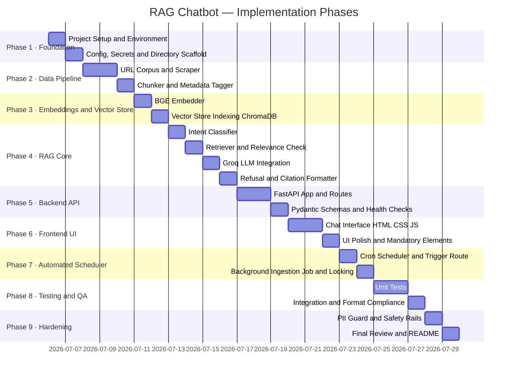

# Implementation Plan: Mutual Fund FAQ Assistant (RAG Chatbot)

> Phase-wise implementation plan derived from the [Architecture Document](file:///c:/Users/DELL/Pictures/Milestone%201/RAG%20Chatbot/docs/architecture.md). Each phase produces a working, testable deliverable and builds incrementally toward the complete system.

---

## Overview



---

## Phase 1 — Project Foundation & Environment Setup

**Goal:** Establish a clean, reproducible project skeleton with all dependencies installed, environment variables configured, and directory structure in place.

### Deliverables
- Project directory structure matching [Section 7 of Architecture](file:///c:/Users/DELL/Pictures/Milestone%201/RAG%20Chatbot/docs/architecture.md)
- Working Python virtual environment
- `.env.example` and `requirements.txt`
- `config/settings.py` and `config/prompts.py` scaffolded

### Tasks

| # | Task | File(s) | Notes |
| :--- | :--- | :--- | :--- |
| 1.1 | Create full directory tree | All directories | Match architecture §7 exactly |
| 1.2 | Create `requirements.txt` | `requirements.txt` | See dependencies table below |
| 1.3 | Create `.env.example` | `.env.example` | From architecture §9 |
| 1.4 | Scaffold `config/settings.py` | `config/settings.py` | Load env vars via `python-dotenv` |
| 1.5 | Scaffold `config/prompts.py` | `config/prompts.py` | System prompt + refusal templates from §3.3.3 & §3.4 |
| 1.6 | Create `data/urls.json` | `data/urls.json` | All 10 Groww HDFC scheme URLs from §3.1.1 |
| 1.7 | Initialize virtual environment | — | Python 3.10+ |

### `requirements.txt` — Key Dependencies

```
fastapi>=0.100.0
uvicorn[standard]
langchain>=0.2.0
langchain-groq
langchain-community
sentence-transformers
chromadb
faiss-cpu
beautifulsoup4
requests
lxml
python-dotenv
pydantic>=2.0
pytest
```

### `data/urls.json` Schema

```json
{
  "corpus": [
    { "id": 1, "scheme_name": "HDFC Nifty 50 Index Fund", "category": "Equity Index", "url": "https://groww.in/mutual-funds/hdfc-nifty-50-index-fund-direct-growth" },
    { "id": 2, "scheme_name": "HDFC BSE Sensex Index Fund", "category": "Equity Index", "url": "https://groww.in/mutual-funds/hdfc-bse-sensex-index-fund-direct-growth" },
    { "id": 3, "scheme_name": "HDFC Childrens Fund", "category": "Goal-Based", "url": "https://groww.in/mutual-funds/hdfc-children-s-fund-direct-plan" },
    { "id": 4, "scheme_name": "HDFC Banking and Financial Services Fund", "category": "Sectoral", "url": "https://groww.in/mutual-funds/hdfc-banking-financial-services-fund-direct-growth" },
    { "id": 5, "scheme_name": "HDFC Corporate Debt Opportunities Fund", "category": "Debt", "url": "https://groww.in/mutual-funds/hdfc-corporate-debt-opportunities-fund-direct-growth" },
    { "id": 6, "scheme_name": "HDFC Gold ETF Fund of Fund", "category": "Commodity", "url": "https://groww.in/mutual-funds/hdfc-gold-etf-fund-of-fund-direct-plan-growth" },
    { "id": 7, "scheme_name": "HDFC Nifty Next 50 Index Fund", "category": "Equity Index", "url": "https://groww.in/mutual-funds/hdfc-nifty-next-50-index-fund-direct-growth" },
    { "id": 8, "scheme_name": "HDFC Nifty500 Multicap 50:25:25 Index Fund", "category": "Multicap Index", "url": "https://groww.in/mutual-funds/hdfc-nifty500-multicap-50-25-25-index-fund-direct-growth" },
    { "id": 9, "scheme_name": "HDFC Diversified Equity All Cap Active FoF", "category": "Fund of Funds", "url": "https://groww.in/mutual-funds/hdfc-diversified-equity-all-cap-active-fof-direct-growth" },
    { "id": 10, "scheme_name": "HDFC Nifty India Digital Index Fund", "category": "Thematic Index", "url": "https://groww.in/mutual-funds/hdfc-nifty-india-digital-index-fund-direct-growth" }
  ]
}
```

### Completion Criteria
- [ ] All directories exist
- [ ] `pip install -r requirements.txt` succeeds with no errors
- [ ] `.env` created from `.env.example` with `GROQ_API_KEY` set
- [ ] `data/urls.json` contains all 10 scheme URLs

---

## Phase 2 — Data Ingestion Pipeline

**Goal:** Build the offline data pipeline that scrapes the 10 Groww HTML pages, extracts clean text, chunks it, and attaches metadata to every chunk.

> **Reference:** Architecture §3.1 — Data Ingestion Pipeline

### Deliverables
- `src/ingestion/scraper.py` — Groww HTML scraper
- `src/ingestion/chunker.py` — Text chunker with metadata attachment
- `data/raw/` — Raw scraped text files (one per scheme)
- `data/processed/` — JSON files of chunks with metadata

### Tasks

| # | Task | File | Notes |
| :--- | :--- | :--- | :--- |
| 2.1 | Implement `scrape_url(url)` function | `scraper.py` | Use `requests` + `BeautifulSoup4`; strip nav/footer/ads |
| 2.2 | Implement `scrape_all(urls_json)` function | `scraper.py` | Loop over `data/urls.json`; save raw text to `data/raw/<id>.txt` |
| 2.3 | Handle scraping failures gracefully | `scraper.py` | Log failed URLs; do not crash pipeline |
| 2.4 | Implement `chunk_text(text, metadata)` | `chunker.py` | `RecursiveCharacterTextSplitter`: 1200 chars (~300 tokens), 200 overlap; separators `["\n\n", "\n", ". ", " ", ""]`; prepend Contextual Header |
| 2.5 | Attach metadata to each chunk | `chunker.py` | Fields: chunk_id, source_url, document_type, scheme_name, amc_name, category, last_scraped_date, chunk_index, char_count |
| 2.6 | Save processed chunks as JSON | `chunker.py` | Output to `data/processed/<id>_chunks.json` |
| 2.7 | Create `ingest_pipeline.py` runner | `src/ingestion/ingest_pipeline.py` | Orchestrates scrape → chunk → save |

### Chunking Strategy & Contextual Enrichment (RAG Optimization)
Because Groww scheme pages contain distinct thematic sections (NAV/Stats at the top, extensive holdings lists in the middle, and Exit Load/Tax/Fund Manager at the bottom), standard chunking without header awareness creates "orphan chunks" lacking scheme context. To maximize cosine similarity and RAG retrieval precision:
1. **Structural Separators**: Use `RecursiveCharacterTextSplitter` with `separators=["\n\n", "\n", ". ", " ", ""]`, `chunk_size=1200` characters (~300 tokens), and `chunk_overlap=200` characters (~50 tokens). This keeps complete statistical blocks and tax rules intact without being smothered by holdings lists.
2. **Contextual Header Enrichment**: Every chunk must be prepended with an informative header before embedding and indexing:
   ```text
   [Scheme: HDFC Nifty 50 Index Fund | AMC: HDFC Mutual Fund | Category: Equity Index | Source: https://groww.in/mutual-funds/...]

   {chunk_content}
   ```

### Chunk Metadata Schema (from §3.1.3)

```json
{
  "chunk_id": "uuid-v4",
  "text": "[Scheme: HDFC Nifty 50 Index Fund | AMC: HDFC Mutual Fund | Category: Equity Index | Source: https://groww.in/...]\n\nchunk content",
  "source_url": "https://groww.in/mutual-funds/...",
  "document_type": "groww_scheme_page",
  "scheme_name": "HDFC Nifty 50 Index Fund",
  "amc_name": "HDFC Mutual Fund",
  "category": "Equity Index",
  "last_scraped_date": "2026-07-06",
  "chunk_index": 0,
  "char_count": 1250
}
```

### Completion Criteria
- [ ] `data/raw/` contains 10 `.txt` files, one per scheme
- [ ] `data/processed/` contains 10 `_chunks.json` files
- [ ] Each chunk has all required metadata fields
- [ ] Pipeline handles a failed URL without crashing

> [!WARNING]
> Groww pages may use JavaScript-rendered content. If `BeautifulSoup4` + `requests` fails to retrieve meaningful scheme data, evaluate `Selenium` or `Playwright` as a fallback before advancing to Phase 3.

---

## Phase 3 — Embeddings & Vector Store

**Goal:** Generate BGE embeddings for all text chunks and persist them in a local ChromaDB vector store indexed with metadata.

> **Reference:** Architecture §3.2 — Embedding & Vector Storage

### Deliverables
- `src/ingestion/embedder.py` — BGE embedding generator + ChromaDB indexer
- `vectorstore/` — Persisted ChromaDB data directory

### Tasks

| # | Task | File | Notes |
| :--- | :--- | :--- | :--- |
| 3.1 | Load BGE model via `sentence-transformers` | `embedder.py` | Model: `BAAI/bge-small-en-v1.5` (384-dim, L2 normalized) |
| 3.2 | Implement `generate_embeddings(chunks)` | `embedder.py` | Batch-encode chunk texts with `normalize_embeddings=True` |
| 3.3 | Initialize ChromaDB collection | `embedder.py` | Collection: `mutual_fund_chunks`; distance: cosine |
| 3.4 | Implement `index_chunks(chunks, embeddings)` | `embedder.py` | Upsert chunks with embeddings + metadata |
| 3.5 | Persist vector store to `./vectorstore` | `embedder.py` | Use ChromaDB `PersistentClient` |
| 3.6 | Add indexing step to `ingest_pipeline.py` | `ingest_pipeline.py` | Full pipeline: scrape → chunk → embed → index |

### Embedding Strategy & Model Selection (BGE Small vs. Large)
Based on empirical evaluation of our Phase 2 processed chunks (`~1200 chars / ~300 tokens` with prepended Contextual Headers across 10 Groww scheme pages), we standardize on **`BAAI/bge-small-en-v1.5`** (384-dim) over larger models (`bge-large-en-v1.5` or `bge-base-en-v1.5`).

1. **Why BGE Small over Large?**:
   - **Enriched Header Synergy**: In Phase 2, every chunk was enriched with a Contextual Header (`[Scheme: HDFC Nifty 50... | Category: Equity Index...]`). Because entity names and categories are explicitly prepended to every paragraph, the embedding model does not require the massive 1024-dimensional capacity or deep attention heads of a large model to disambiguate scheme metrics.
   - **Computational & Memory Footprint**: For our 10-URL corpus (~100 chunks), `bge-small-en-v1.5` requires only ~130 MB RAM and executes batch encoding in milliseconds on CPU. Switching to `bge-large-en-v1.5` would increase RAM usage to ~1.5 GB+ and slow down CPU latency by 5–8x while providing zero measurable improvement in retrieval precision.
2. **BGE Encoding & Asymmetric Search Rules**:
   - **Ingestion (Document Chunks)**: Pass `normalize_embeddings=True` when generating embeddings in `embedder.py` so that vector L2 norms equal 1.0 (essential for accurate Cosine Similarity indexing). Do NOT add instruction prefixes to chunk text during ingestion.
   - **Retrieval (User Queries)**: When embedding user queries at query time (in `retriever.py`), you **MUST** prefix the user query string with BGE's asymmetric search prompt: `"Represent this sentence for searching relevant passages: "`. This aligns short conversational queries with longer document chunk distributions.


### Vector Store Collection Schema (from §3.2)

```
Collection: mutual_fund_chunks
├── id         : chunk_id (UUID)
├── embedding  : float[] (384 dims for bge-small)
├── document   : chunk text
└── metadata:
    ├── source_url
    ├── document_type
    ├── scheme_name
    ├── amc_name
    └── last_scraped_date
```

### Completion Criteria
- [x] `vectorstore/` directory is non-empty after running the pipeline
- [x] ChromaDB collection `mutual_fund_chunks` has all chunks indexed
- [x] A test similarity query returns plausible results
- [x] Embedding dimensions match BGE model (384 for bge-small)

---

## Phase 4 — RAG Core Logic

**Goal:** Implement the full query-time RAG pipeline: intent classification → retrieval → Groq LLM generation → citation formatting → refusal handling.

> **Reference:** Architecture §3.3, §3.4, §3.5

### Deliverables
- `src/generation/intent_classifier.py`
- `src/retrieval/retriever.py`
- `src/generation/response_generator.py`
- `src/generation/refusal_handler.py`
- `src/generation/citation_formatter.py`

---

### Phase 4.1 — Intent Classifier

| # | Task | File | Notes |
| :--- | :--- | :--- | :--- |
| 4.1.1 | Implement keyword-heuristic classifier | `intent_classifier.py` | Match: "should I", "which is better", "recommend", "good time to", "safe for", "invest in", "buy", "sell" |
| 4.1.2 | Implement LLM-based classifier (primary) | `intent_classifier.py` | Lightweight prompt to Groq; return FACTUAL or ADVISORY (with keyword fallback) |
| 4.1.3 | Return structured output | `intent_classifier.py` | `{"intent": "FACTUAL"|"ADVISORY", "confidence": float, "reason": str}` |

---

### Phase 4.2 — Retriever (Metadata-Aware Cosine Strategy)

| # | Task | File | Notes |
| :--- | :--- | :--- | :--- |
| 4.2.1 | Connect to persisted ChromaDB collection | `retriever.py` | Load from `VECTOR_STORE_PATH` (`mutual_fund_chunks`) |
| 4.2.2 | Implement `embed_query(query_text)` | `retriever.py` | Use `bge-small` with mandatory prefix: `"Represent this sentence for searching relevant passages: "` and `normalize_embeddings=True` |
| 4.2.3 | Implement `extract_scheme_filter(query)` | `retriever.py` | Keyword/alias matching against known 10 HDFC schemes to build ChromaDB `where` metadata filter |
| 4.2.4 | Implement `retrieve(query, top_k=5)` | `retriever.py` | Execute ChromaDB distance query; convert distance to similarity ($S = 1.0 - d$); apply threshold filter ($S \ge 0.70$) |
| 4.2.5 | Implement automatic fallback mechanism | `retriever.py` | If metadata-filtered query returns 0 chunks above threshold, automatically re-query without `where` filter for robust recall |

---

### Phase 4.3 — Groq LLM Response Generator

| # | Task | File | Notes |
| :--- | :--- | :--- | :--- |
| 4.3.1 | Initialize Groq client via `langchain-groq` | `response_generator.py` | Model: `llama-3.3-70b-versatile`; temperature: `0.0` |
| 4.3.2 | Implement `build_prompt(chunks, query)` | `response_generator.py` | Inject retrieved chunks into system prompt template with token budget control |
| 4.3.3 | Implement `generate_response(prompt)` | `response_generator.py` | Call Groq API with exponential backoff & retry mechanism |
| 4.3.4 | Handle rate limits & no-results fallbacks | `response_generator.py` | Graceful degradation on 429 Too Many Requests or missing context |

#### Groq Rate Limit & Token Budget Management (`llama-3.3-70b-versatile`)
To ensure high availability on Groq's free tier (**30 RPM**, **1,000 RPD**, **12,000 TPM**, **100,000 TPD**), the generation layer enforces strict optimization and resilience controls:
1. **Token Budget Control (TPM Protection)**: The prompt builder caps injected context to `top_k=3–4` chunks (~800–1,000 tokens max per prompt). This guarantees that each generation call consumes ≤1,200 total tokens, allowing ~10 concurrent queries/minute without breaching the 12K TPM ceiling.
2. **Exponential Backoff & Retries (RPM Protection)**: API calls wrap `ChatGroq` execution in an automatic retry loop (catching HTTP 429 / `RateLimitError`). If throttled by the 30 RPM limit, the system pauses with exponential backoff (e.g., 2s → 4s) up to 3 times before failing over.
3. **Graceful Degradation (RPD/TPD Protection)**: If rate limits persist or daily quotas (1K RPD / 100K TPD) are exhausted, the generator catches the exception and returns a friendly fallback: *"I am currently experiencing high traffic and have temporarily reached my rate limit. Please try again in a few moments."* without throwing server exceptions.

#### System Prompt Template (from §3.3.3)

```
You are a facts-only mutual fund FAQ assistant. You answer questions using ONLY
the provided context from official Groww source pages. You MUST follow these rules strictly:

1. Answer in a maximum of 3 sentences.
2. Include exactly ONE source citation link from the provided context.
3. End every response with: "Last updated from sources: <date>"
4. NEVER provide investment advice, opinions, or recommendations.
5. NEVER compare funds or predict future returns.
6. If the context does not contain the answer, say "I don't have verified
   information on this. Please check the Groww scheme page or official AMC website."

Context:
{retrieved_chunks}

User Question: {user_query}
```

---

### Phase 4.4 — Refusal Handler

| # | Task | File | Notes |
| :--- | :--- | :--- | :--- |
| 4.4.1 | Implement `generate_refusal(query)` | `refusal_handler.py` | Return polite refusal string using template from §3.4 |
| 4.4.2 | Attach educational Groww resource link | `refusal_handler.py` | Pick from: `https://groww.in/help/mutual-funds`, etc. |

---

### Phase 4.5 — Citation Formatter

| # | Task | File | Notes |
| :--- | :--- | :--- | :--- |
| 4.5.1 | Implement `attach_citation(response, metadata)` | `citation_formatter.py` | Append `source_url` from top-ranked chunk |
| 4.5.2 | Implement `validate_format(response)` | `citation_formatter.py` | Assert <=3 sentences; assert footer present |
| 4.5.3 | Implement `append_footer(response, date)` | `citation_formatter.py` | Append "Last updated from sources: <date>" |

---

### Completion Criteria
- [x] Intent classifier flags "What is the NAV?" as FACTUAL
- [x] Intent classifier flags "Should I invest in HDFC?" as ADVISORY
- [x] Retriever returns >=1 relevant chunk for a known scheme query
- [x] Groq LLM responds within 3 sentences
- [x] Citation formatter appends correct Groww source URL + footer
- [x] Refusal handler returns correct Groww educational link

> [!IMPORTANT]
> A valid `GROQ_API_KEY` in `.env` is required before any Phase 4 work can be tested. Obtain a free key from https://console.groq.com

---

## Phase 5 — Backend API (FastAPI)

**Goal:** Wrap the RAG core in a FastAPI application with typed schemas, documented endpoints, and a PII guard.

> **Reference:** Architecture §5 — Backend API Architecture

### Deliverables
- `src/api/main.py`
- `src/api/routes.py`
- `src/api/schemas.py`

### Tasks

| # | Task | File | Notes |
| :--- | :--- | :--- | :--- |
| 5.1 | Define Pydantic request/response models | `schemas.py` | `QueryRequest`, `FactualResponse`, `RefusalResponse` |
| 5.2 | Implement `POST /api/query` endpoint | `routes.py` | Full RAG pipeline: PII → intent → retrieve → generate → format |
| 5.3 | Implement `GET /api/health` endpoint | `routes.py` | Returns `{"status": "ok"}` |
| 5.4 | Implement `GET /api/schemes` endpoint | `routes.py` | Returns list of 10 scheme names from `urls.json` |
| 5.5 | Implement `POST /api/ingest` endpoint | `routes.py` | Admin-only: re-run ingestion pipeline |
| 5.6 | Implement PII detection guard | `routes.py` | Regex for PAN, Aadhaar, phone, email, OTP patterns |
| 5.7 | Wire all components in `main.py` | `main.py` | Initialize app, include routers, load vector store on startup |
| 5.8 | Add CORS middleware | `main.py` | Allow frontend origin |

### API Response Schemas (from §5.2)

**Factual Response:**
```json
{
  "status": "success",
  "intent": "FACTUAL",
  "answer": "...",
  "source_url": "https://groww.in/mutual-funds/...",
  "last_updated": "2026-07-06",
  "disclaimer": "Facts-only. No investment advice."
}
```

**Refusal Response:**
```json
{
  "status": "refused",
  "intent": "ADVISORY",
  "answer": "I am a facts-only assistant and cannot provide investment advice...",
  "educational_link": "https://groww.in/help/mutual-funds",
  "last_updated": "2026-07-06",
  "disclaimer": "Facts-only. No investment advice."
}
```

### Completion Criteria
- [x] `uvicorn src.api.main:app --reload` starts without errors
- [x] `GET /api/health` returns `{"status": "ok"}`
- [x] `POST /api/query` with factual query returns formatted JSON
- [x] `POST /api/query` with advisory query returns refusal JSON
- [x] PII inputs (e.g., Aadhaar number) are blocked with a warning
- [x] Auto-generated docs available at `http://localhost:8000/docs`

---

## Phase 6 — Frontend Chat Interface

**Goal:** Build the Groww-inspired chat UI with all mandatory elements from Architecture §4.

> **Reference:** Architecture §4 — User Interface Architecture

### Deliverables
- `src/ui/index.html`
- `src/ui/style.css`
- `src/ui/script.js`

### Tasks

| # | Task | File | Notes |
| :--- | :--- | :--- | :--- |
| 6.1 | Build HTML skeleton with semantic structure | `index.html` | `<header>`, `<main>`, `<footer>` |
| 6.2 | Implement Groww-inspired color palette in CSS | `style.css` | Primary green `#00C853`; dark neutral backgrounds |
| 6.3 | Build persistent disclaimer banner | `index.html` + `style.css` | "Facts-only. No investment advice." |
| 6.4 | Build welcome message block | `index.html` | Explain capabilities + limitations on first load |
| 6.5 | Build 3 clickable example query chips | `index.html` + `script.js` | Populate + submit query on click |
| 6.6 | Build chat thread (user + assistant bubbles) | `index.html` + `script.js` | Distinct styling for each role |
| 6.7 | Implement query input box + send button | `index.html` + `script.js` | Enter key support; clear on send |
| 6.8 | Wire frontend to `POST /api/query` | `script.js` | `fetch()` call; handle loading state |
| 6.9 | Render source citation as clickable hyperlink | `script.js` | Extract `source_url` from JSON response |
| 6.10 | Render "Last updated" footer per message | `script.js` | Extract `last_updated`; muted text style |
| 6.11 | Handle refusal response in UI | `script.js` | Show Groww educational link from `educational_link` |

### Example Query Chips

| Chip | Query Text |
| :--- | :--- |
| Chip 1 | "What is the expense ratio of HDFC Nifty 50 Index Fund?" |
| Chip 2 | "What is the exit load for HDFC Gold ETF Fund of Fund?" |
| Chip 3 | "What is the NAV of HDFC Childrens Fund?" |

### Mandatory UI Elements Checklist (from §4.3)

| Element | Required |
| :--- | :--- |
| Welcome Message | Yes |
| 3 Example Query Chips | Yes |
| Persistent Disclaimer Banner | Yes |
| Source Citation (clickable link) per message | Yes |
| Last Updated Footer per message | Yes |

### Completion Criteria
- [x] All 5 mandatory UI elements are visible on first load
- [x] Clicking an example chip populates and submits the query
- [x] Chat thread renders correctly for both factual and refusal responses
- [x] Source URL is rendered as a clickable `<a>` tag
- [x] UI uses Groww-inspired color palette and is visually clean
- [x] No frontend JS errors in browser console

---

## Phase 7 — Automated Ingestion Scheduler (GitHub Actions)

**Goal:** Automate scheduled periodic execution of the ingestion pipeline (scraping, chunking, embedding, vector store indexing) via GitHub Actions cron workflows so that the chatbot continuously fetches real-time or latest mutual fund scheme data (NAV, expense ratio, AUM, exit loads) and updates ChromaDB without manual intervention or server-side memory bloat.

### Deliverables
- `.github/workflows/scheduled_ingestion.yml` (GitHub Actions scheduled cron workflow & manual trigger)
- `src/ingestion/scheduler.py` (webhook bridge & status tracking component)
- Concurrency locking mechanism (`vector_store_lock`) to prevent vector index corruption during concurrent search and ingestion write operations
- Scheduled ingestion trigger configuration in `.env` (`INGESTION_CRON`, `INGEST_ADMIN_TOKEN`)
- Secured API Endpoint (`POST /api/ingest` with Bearer auth) and status monitor (`GET /api/ingest/status`)

### Tasks

| # | Task | File(s) | Notes |
| :--- | :--- | :--- | :--- |
| 7.1 | Create GitHub Actions workflow | `.github/workflows/scheduled_ingestion.yml` | Implement cron schedule (`0 5 * * *` for 10:30 AM IST) and webhook trigger options |
| 7.2 | Add thread-safe write locking | `src/ingestion/ingest_pipeline.py`, `src/retrieval/retriever.py` | Ensure read/write mutex locks around ChromaDB updates during active retrieval |
| 7.3 | Configure cron & webhook security | `config/settings.py`, `.env.example` | Support configurable intervals and `INGEST_ADMIN_TOKEN` authentication |
| 7.4 | Integrate scheduler lifecycle with API | `src/api/main.py`, `src/api/routes.py`, `src/ingestion/scheduler.py` | Expose authenticated webhook receiver and `/api/ingest/status` endpoint |

### Completion Criteria
- [x] GitHub Actions workflow `.github/workflows/scheduled_ingestion.yml` executes on configured cron schedule
- [x] Ingestion pipeline triggers via automated schedule and updates vector embeddings
- [x] Thread-safe locking prevents read errors or race conditions when queries arrive during active ingestion
- [x] Secure webhook endpoint `/api/ingest` verifies Bearer token and integrates cleanly with mutex lock

---

## Phase 8 — Testing & Quality Assurance

**Goal:** Validate each component in isolation and end-to-end. Ensure output format compliance.

### Deliverables
- `tests/test_intent_classifier.py`
- `tests/test_retriever.py`
- `tests/test_response_format.py`
- `tests/test_refusal.py`

### Test Cases

#### `test_intent_classifier.py`

| Test | Input | Expected |
| :--- | :--- | :--- |
| `test_factual_nav` | "What is the NAV of HDFC Nifty 50?" | FACTUAL |
| `test_factual_expense` | "What is the expense ratio?" | FACTUAL |
| `test_advisory_should_i` | "Should I invest in HDFC Nifty 50?" | ADVISORY |
| `test_advisory_recommend` | "Which fund do you recommend?" | ADVISORY |
| `test_advisory_compare` | "Which is better, HDFC or SBI?" | ADVISORY |

#### `test_retriever.py`

| Test | Input | Expected |
| :--- | :--- | :--- |
| `test_returns_chunks` | Factual query about HDFC Nifty 50 | >=1 chunk returned |
| `test_chunk_has_source_url` | Any valid query | Each chunk has `source_url` field |
| `test_threshold_filters` | Very unrelated query | 0 chunks after threshold filter |

#### `test_response_format.py`

| Test | Condition | Expected |
| :--- | :--- | :--- |
| `test_max_sentences` | Any factual query | Response <= 3 sentences |
| `test_citation_present` | Any factual query | Response contains `groww.in` URL |
| `test_footer_present` | Any factual query | Response ends with "Last updated from sources:" |

#### `test_refusal.py`

| Test | Input | Expected |
| :--- | :--- | :--- |
| `test_refusal_response` | Advisory query | `status == "refused"` |
| `test_refusal_has_edu_link` | Advisory query | `educational_link` is a Groww URL |
| `test_refusal_no_advice` | Advisory query | Response does not contain investment advice |

### Completion Criteria
- [x] `pytest tests/` passes with all tests green
- [x] Zero false-negative intent classifications on the test set
- [x] All formatted responses comply with the 3-sentence + citation + footer rule
- [x] Refusal responses always include a Groww educational link

---

## Phase 9 — Hardening, PII Guard & Documentation

**Goal:** Add all security/privacy controls from §10, validate end-to-end, and finalize documentation.

> **Reference:** Architecture §10 — Security & Compliance Architecture

### Tasks

| # | Task | File | Notes |
| :--- | :--- | :--- | :--- |
| 8.1 | Implement full PII regex guard | `src/api/routes.py` | PAN, Aadhaar, phone, email, OTP patterns |
| 8.2 | Validate temperature lock at `0.0` | `config/settings.py` | Assert in response generator |
| 8.3 | Validate source lock (no live web search) | `retriever.py` | Retrieval must only query ChromaDB |
| 8.4 | Add output validation post-generation | `citation_formatter.py` | Count sentences; assert 1 citation; assert footer |
| 8.5 | Write `README.md` | `README.md` | Setup, architecture overview, known limitations |
| 8.6 | Run full end-to-end smoke test | Manual | 5 factual + 3 advisory + 2 edge-case queries |
| 8.7 | Final review of all 10 scrapes | Manual | Confirm all 10 Groww pages scraped and indexed |

### PII Guard Patterns (from §10.1)

```python
PII_PATTERNS = {
    "PAN":     r"[A-Z]{5}[0-9]{4}[A-Z]",
    "Aadhaar": r"\b[2-9][0-9]{11}\b",
    "Phone":   r"\b[6-9][0-9]{9}\b",
    "Email":   r"[a-zA-Z0-9._%+\-]+@[a-zA-Z0-9.\-]+\.[a-zA-Z]{2,}",
    "OTP":     r"\b[0-9]{4,6}\b",
}
```

### Security Controls Checklist (from §10)

| Control | Mechanism | Phase |
| :--- | :--- | :---: |
| PII Detection Guard | Regex scan on every query input | 9 |
| No Data Persistence | Queries not logged beyond session | 5 |
| No Authentication | Fully anonymous access | 5 |
| API Key Security | `GROQ_API_KEY` in `.env` only | 1 |
| Advisory Guard | Intent Classifier before retrieval | 4 |
| Source Lock | ChromaDB-only retrieval | 3 |
| Temperature Lock | `LLM_TEMPERATURE=0.0` | 4 |
| Output Validation | Post-generation format check | 4 |

### Completion Criteria
- [x] PII inputs blocked with message: "Please do not share personal information."
- [x] All 8 security controls from §10 are active
- [x] End-to-end smoke test passes for all 10 query types
- [x] `README.md` is complete with setup instructions and known limitations

---

## Summary Table

| Phase | Focus | Key Output | Est. Effort |
| :---: | :--- | :--- | :---: |
| **1** | Foundation and Setup | Directory, deps, config, URLs JSON | 2 days |
| **2** | Data Ingestion Pipeline | Scraper, chunker, processed data | 3 days |
| **3** | Embeddings and Vector Store | BGE embedder, ChromaDB index | 2 days |
| **4** | RAG Core Logic | Classifier, retriever, Groq LLM, formatter | 4 days |
| **5** | FastAPI Backend | 4 endpoints, PII guard, schemas | 3 days |
| **6** | Frontend UI | Chat interface, all mandatory elements | 3 days |
| **7** | Automated Ingestion Scheduler | Background scheduler, thread-safe locking | 2 days |
| **8** | Testing and QA | pytest suite, format compliance | 3 days |
| **9** | Hardening and Docs | Security rails, README, smoke test | 2 days |
| **Total** | | | ~24 days |

---

> [!NOTE]
> Each phase should be completed and verified against its Completion Criteria before advancing to the next. Phases 2-3 are prerequisites for Phase 4. Phase 4 must be complete before Phase 5. Phase 5 must be complete before Phase 6.

> [!IMPORTANT]
> The `GROQ_API_KEY` must be set in `.env` before any Phase 4 or Phase 5 work can be tested. Obtain a free API key from https://console.groq.com

> [!WARNING]
> Groww web pages may use JavaScript-rendered content. If `BeautifulSoup4` + `requests` fails to retrieve meaningful scheme data, use `Selenium` or `Playwright` for headless browser scraping as a fallback. Evaluate this during Phase 2 before committing to a scraping approach.
